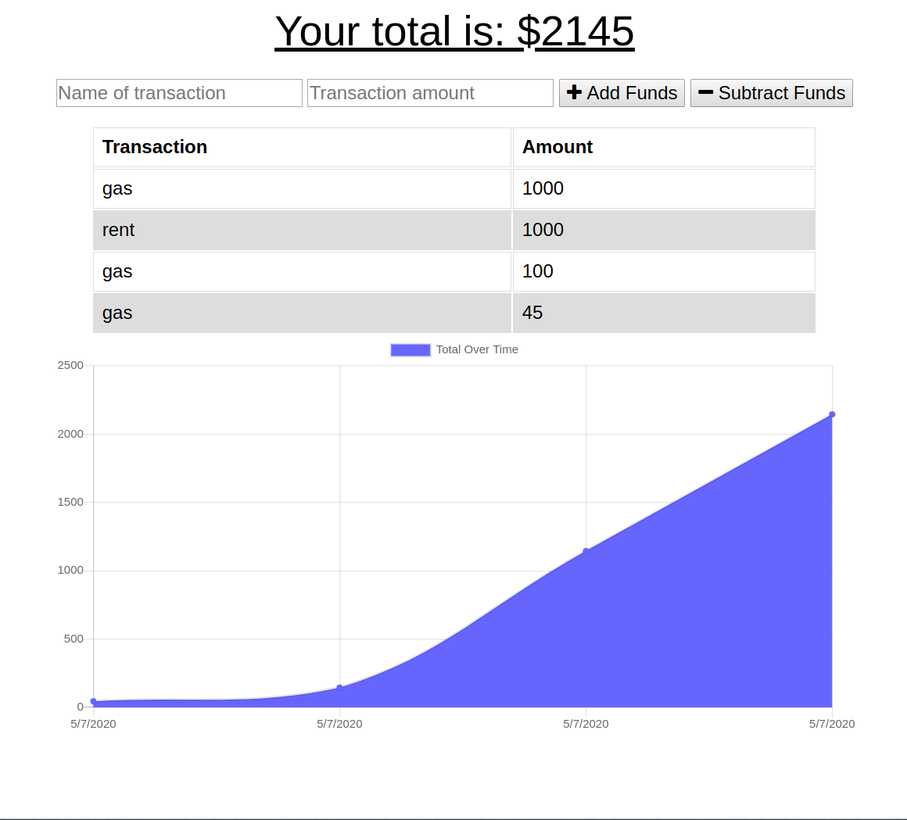

## Budget-App 
<a href="https://budgettrackerbootcamp.herokuapp.com/">Try It Out</a>

## Description

BUDGET-TRACKER - A quick and easy to way to keep track of your spending and bills.  You can name each transaction and choose between adding or subtracting.  This is also a progressive webapp with service workers that give you offline capabilities.

## Table of Contents

* [Installation](#Installation) 

* [Technologies](#Technologies) 

* [Motivation](#Motivation)

* [Questions](#Questions)

## Motivation

This project was motivated by the UCLA Full Stack Developer Program.

## Installation

To install necessary dependencies, run the following command.

    npm install

To install the PWA.

    Open Google Chrome.

    Click on the 3 dots icon in the upper-right corner.

    Choose Install-Budget-App

## Technologies

    HTML/CSS/JAVASCRIPT/NODE/EXPRESS/MONGODB/SERVICE WORKERS

    
 
## Questions

 <a href="https://vartanyane.github.io/portfolioFinal/">If you have any questions please contact me</a>